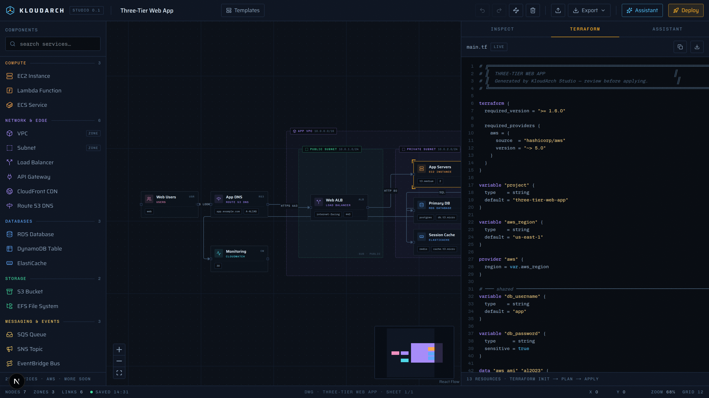

<p align="center">
  
</p>

<h1 align="center">KloudArch</h1>

<p align="center">
  <b>Open-source cloud architecture design studio.</b><br/>
  Draft architectures on a blueprint canvas, refine them with an AI copilot,<br/>
  and export working Terraform — all in the browser.
</p>

> v0.2 — design studio + one-click deploy. Draft it, review the change set, ship it.



## Features

- **Drafting canvas** — drag 27 AWS-flavored components (compute, network,
  data, storage, messaging, security…) onto an infinite blueprint grid,
  wire them together, and group them in resizable VPC / subnet zones.
  Internet/NAT gateways derive route tables automatically; ALB connections
  derive security groups — diagrams deploy as routable networks.
- **Live IaC, two formats** — `main.tf` (Terraform) and `template.json`
  (CloudFormation) regenerate on every edit. Connections become real wiring:
  ALB target groups, API Gateway → Lambda integrations, SQS event source
  mappings, CloudFront origins, Route 53 aliases. Services dropped inside
  VPC/subnet zones get the right VPC/subnet references from geometric
  containment. More backends are planned — each is one emitter file.
- **One-click deploy** — the studio deploys designs as CloudFormation stacks
  with your own AWS credentials: preflight checks (account, design lints),
  a reviewable change set (add/modify/remove, replacement flags), a live
  stack-event log, outputs on success, and a type-to-confirm teardown.
- **AI copilot** — describe what you want ("make this event-driven", "add a
  cache layer") and the assistant edits the canvas through tools. Bring your
  own key: Anthropic, OpenAI, Google, or the Vercel AI Gateway, configured
  entirely through environment variables.
- **Templates** — three-tier web app, serverless API, event-driven pipeline,
  static site + CDN — or start from a blank sheet.
- **Studio ergonomics** — undo/redo, duplicate, auto-arrange (dagre),
  multi-select, snap-to-grid, minimap, autosave to localStorage, and
  import/export of portable `.kloudarch.json` design files.

## Quickstart

```bash
npm install
npm run dev
```

Open http://localhost:3000 for the landing page, or jump straight into the
studio at http://localhost:3000/studio — it works fully without any configuration.

### Enable the AI copilot

```bash
cp .env.example .env.local
# add ONE key, then restart the dev server
```

| Variable | Notes |
| --- | --- |
| `ANTHROPIC_API_KEY` | default model `claude-sonnet-4-6` |
| `OPENAI_API_KEY` | default model `gpt-5.5` |
| `GOOGLE_GENERATIVE_AI_API_KEY` | default model `gemini-3.5-flash` |
| `AI_GATEWAY_API_KEY` | Vercel AI Gateway, default `anthropic/claude-sonnet-4.6` |
| `AI_PROVIDER` *(optional)* | force `anthropic` / `openai` / `google` / `gateway` |
| `AI_MODEL` *(optional)* | override the default model id |
| `AI_CHAT_DISABLED` *(optional)* | set to `1` on public deployments to switch the copilot off (visitors are pointed to self-hosting instead) |

Keys never leave your server: the browser talks to `/api/chat`, which calls
the provider with the key from your environment.

### Enable deploy-from-studio

```bash
# .env.local — use a SANDBOX account; these credentials create and destroy
# real infrastructure
AWS_ACCESS_KEY_ID=AKIA…
AWS_SECRET_ACCESS_KEY=…
```

Deploys run as **CloudFormation stacks** (`kloudarch-<project>`): the studio
computes a change set, you review every add/modify/remove, and AWS executes it
natively — no runner infrastructure. Terraform remains the portable export.
Re-deploying the same project diffs against the existing stack; teardown
deletes it.

If anyone but you can reach your instance, set `DEPLOY_PASSWORD=<secret>` —
the deploy dialog will require it before touching AWS. Set `DEPLOY_DISABLED=1`
to switch deployments off entirely (as on kloudarch.com).

## How it works

```
src/
├─ lib/
│  ├─ catalog.ts      # service registry: categories, config fields, icons
│  ├─ store.ts        # zustand design store: history, persistence, actions
│  ├─ terraform.ts    # design graph → HCL (per-service emitters + edge wiring)
│  ├─ templates.ts    # starter architectures
│  ├─ autolayout.ts   # dagre left-to-right arrangement
│  └─ ai-bridge.ts    # AI tool calls → store mutations
├─ components/studio/ # canvas, palette, inspector, terraform panel, chat
└─ app/api/chat/      # AI SDK streamText route with client-executed tools
```

The AI copilot uses [AI SDK v6](https://ai-sdk.dev) client-side tools: the
model streams tool calls (`add_nodes`, `connect_nodes`, …), the browser applies
them to the canvas store, and the results stream back for the next step. Every
request includes a compact snapshot of the current design, so the copilot
always works with what you see.

## Roadmap

- More IaC backends (Pulumi, CDK) from the same design graph
- GCP / Azure catalogs, custom components
- Multi-file Terraform output
- Shareable links and real-time collaboration

## Contributing

Issues and PRs welcome. The service catalog (`src/lib/catalog.ts`) and the
Terraform emitters (`src/lib/terraform.ts`) are designed to be easy to extend —
adding a service is one catalog entry plus one emitter.

## License

[MIT](./LICENSE)
